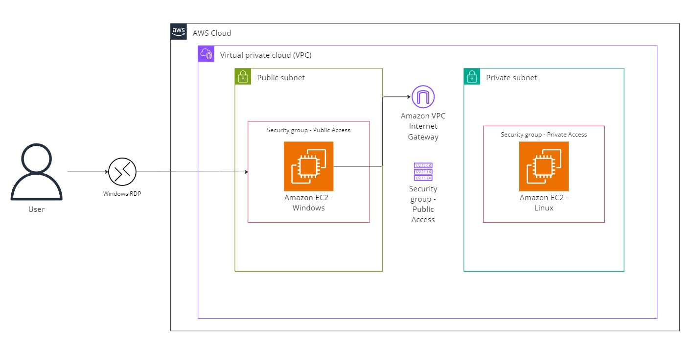
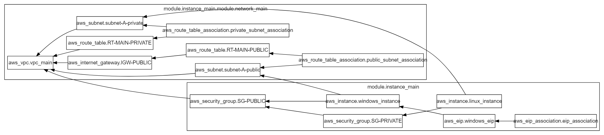

## Projeto de Infraestrutura Básica

Projeto em Terraform simples como desafio da pós graduação.

## Requisitos 

```
1. Criação de uma instância Linux em uma Sub-rede Privada.

2. Criação de uma instância bastion-host Windows em uma sub-rede pública recebendo um Elastic IP.

3. Criar as tabelas de Tabelas de Rotas.

4. Utilizar NAT Gateway para acesso externo (internet) do bastion-host. 

5. Validar utilizando o acesso via RDP do bastion-host. 

6. Validar o acesso a rede privada com ping na máquina Linux. 
```

## Arquitetura AWS



## Diagrama do Terraform


```json
digraph G {
  rankdir = "RL";
  node [shape = rect, fontname = "sans-serif"];
  subgraph "cluster_module.instance_main" {
    label = "module.instance_main"
    fontname = "sans-serif"
    "module.instance_main.aws_eip.windows_eip" [label="aws_eip.windows_eip"];
    "module.instance_main.aws_eip_association.eip_association" [label="aws_eip_association.eip_association"];
    "module.instance_main.aws_instance.linux_instance" [label="aws_instance.linux_instance"];
    "module.instance_main.aws_instance.windows_instance" [label="aws_instance.windows_instance"];
    "module.instance_main.aws_security_group.SG-PRIVATE" [label="aws_security_group.SG-PRIVATE"];
    "module.instance_main.aws_security_group.SG-PUBLIC" [label="aws_security_group.SG-PUBLIC"];
  }
  subgraph "cluster_module.instance_main.module.network_main" {
    label = "module.instance_main.module.network_main"
    fontname = "sans-serif"
    "module.instance_main.module.network_main.aws_internet_gateway.IGW-PUBLIC" [label="aws_internet_gateway.IGW-PUBLIC"];
    "module.instance_main.module.network_main.aws_route_table.RT-MAIN-PRIVATE" [label="aws_route_table.RT-MAIN-PRIVATE"];
    "module.instance_main.module.network_main.aws_route_table.RT-MAIN-PUBLIC" [label="aws_route_table.RT-MAIN-PUBLIC"];
    "module.instance_main.module.network_main.aws_route_table_association.private_subnet_association" [label="aws_route_table_association.private_subnet_association"];
    "module.instance_main.module.network_main.aws_route_table_association.public_subnet_association" [label="aws_route_table_association.public_subnet_association"];
    "module.instance_main.module.network_main.aws_subnet.subnet-A-private" [label="aws_subnet.subnet-A-private"];
    "module.instance_main.module.network_main.aws_subnet.subnet-A-public" [label="aws_subnet.subnet-A-public"];
    "module.instance_main.module.network_main.aws_vpc.vpc_main" [label="aws_vpc.vpc_main"];
  }
  "module.instance_main.aws_eip.windows_eip" -> "module.instance_main.aws_instance.windows_instance";
  "module.instance_main.aws_eip_association.eip_association" -> "module.instance_main.aws_eip.windows_eip";
  "module.instance_main.aws_instance.linux_instance" -> "module.instance_main.aws_security_group.SG-PRIVATE";
  "module.instance_main.aws_instance.linux_instance" -> "module.instance_main.module.network_main.aws_subnet.subnet-A-private";
  "module.instance_main.aws_instance.windows_instance" -> "module.instance_main.aws_security_group.SG-PUBLIC";
  "module.instance_main.aws_instance.windows_instance" -> "module.instance_main.module.network_main.aws_subnet.subnet-A-public";
  "module.instance_main.aws_security_group.SG-PRIVATE" -> "module.instance_main.aws_security_group.SG-PUBLIC";
  "module.instance_main.aws_security_group.SG-PUBLIC" -> "module.instance_main.module.network_main.aws_vpc.vpc_main";
  "module.instance_main.module.network_main.aws_internet_gateway.IGW-PUBLIC" -> "module.instance_main.module.network_main.aws_vpc.vpc_main";
  "module.instance_main.module.network_main.aws_route_table.RT-MAIN-PRIVATE" -> "module.instance_main.module.network_main.aws_vpc.vpc_main";
  "module.instance_main.module.network_main.aws_route_table.RT-MAIN-PUBLIC" -> "module.instance_main.module.network_main.aws_internet_gateway.IGW-PUBLIC";
  "module.instance_main.module.network_main.aws_route_table_association.private_subnet_association" -> "module.instance_main.module.network_main.aws_route_table.RT-MAIN-PRIVATE";
  "module.instance_main.module.network_main.aws_route_table_association.private_subnet_association" -> "module.instance_main.module.network_main.aws_subnet.subnet-A-private";
  "module.instance_main.module.network_main.aws_route_table_association.public_subnet_association" -> "module.instance_main.module.network_main.aws_route_table.RT-MAIN-PUBLIC";
  "module.instance_main.module.network_main.aws_route_table_association.public_subnet_association" -> "module.instance_main.module.network_main.aws_subnet.subnet-A-public";
  "module.instance_main.module.network_main.aws_subnet.subnet-A-private" -> "module.instance_main.module.network_main.aws_vpc.vpc_main";
  "module.instance_main.module.network_main.aws_subnet.subnet-A-public" -> "module.instance_main.module.network_main.aws_vpc.vpc_main";
}
```
## Gráfico de Dependências




## Melhorias 

- Melhor aplicação de variáveis 
- Documentação do Código 
- 